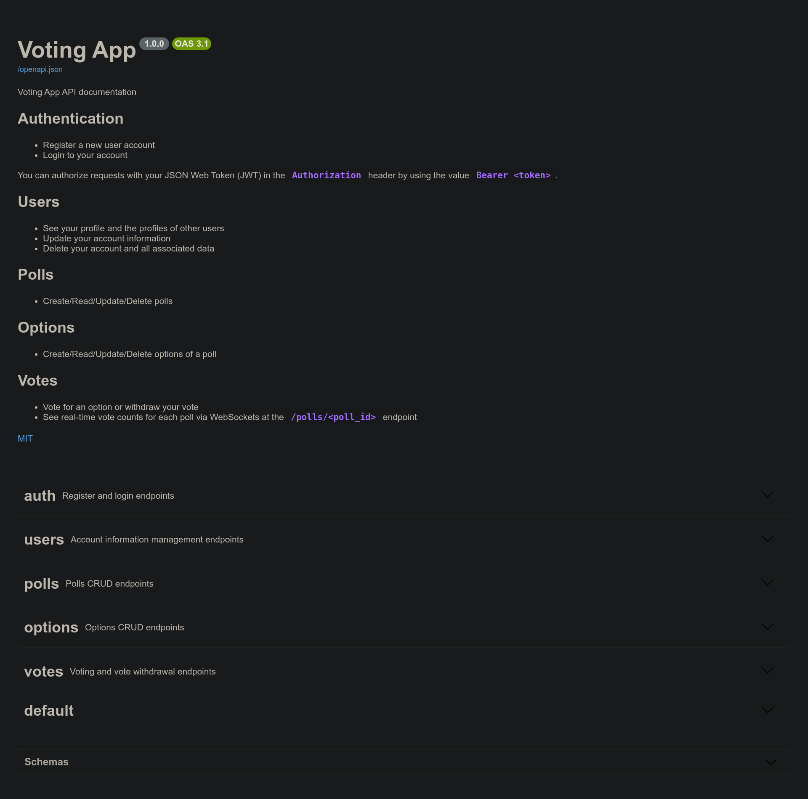

# Voting App


A RESTful microservice for voting with real time updates.

## Overview

The project is implemented with [Python](https://www.python.org/) and [FastAPI](https://fastapi.tiangolo.com/) for the API, with [PostgreSQL](https://www.postgresql.org/) serving as the database. The environment relies on [Docker](https://www.docker.com/) and [Docker Compose](https://docs.docker.com/compose/).

The `docker-compose.yml` file also includes two additional services: `prometheus` and `grafana`, used for monitoring.

## Running locally

To run the project, first clone the repository and navigate to the `voting-app` directory.

```sh
git clone https://github.com/infamous55/voting-app.git && cd voting-app
```

Start the development server using the following command:

```sh
docker-compose up
```

The documentation, provided in OpenAPI format, can be found at `http://localhost:8000/docs/`.



[Prometheus](https://prometheus.io/) is available at `http://localhost:9090/`, and [Grafana](https://grafana.com) at `http://localhost:3000/`.

## To Do:

- [ ] Add production environment for deployment
- [ ] Add unit tests
- [ ] Add tracing with [OpenTelemetry](https://opentelemetry.io/)

## Contributing

Pull requests are welcome. For major changes, please open an issue first to discuss what you would like to change.

## License

Distributed under the MIT License. See `LICENSE` for more information.
